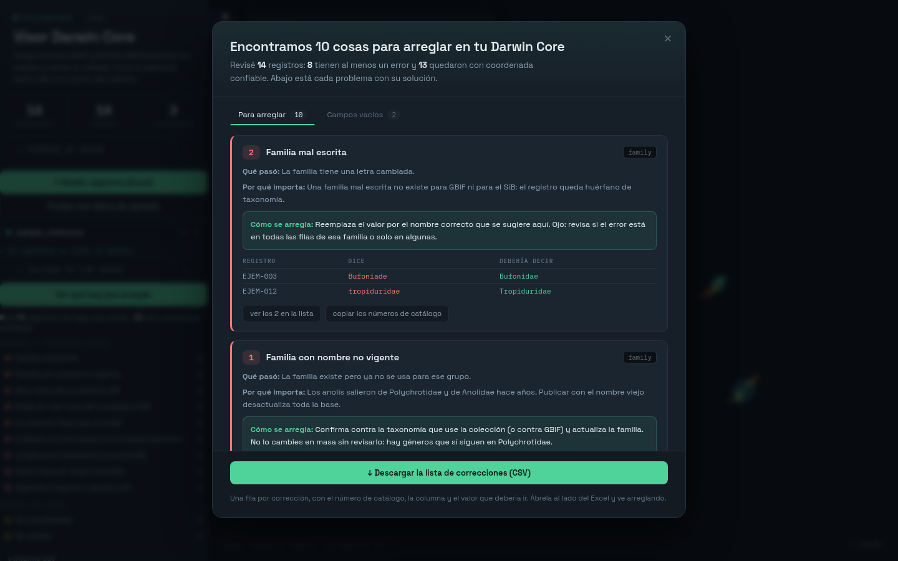

# VisionCore

Visor y validador de datos **Darwin Core** para colecciones biológicas. Abre un archivo de la plantilla del SiB Colombia, lo pone en un mapa y te dice qué hay que corregir antes de publicarlo — con la corrección concreta, no solo el diagnóstico.

Corre entero en el navegador: una página HTML, sin servidor, sin cuenta, sin instalar nada. **Los datos nunca salen de tu computador.**

## Para qué sirve

Publicar un conjunto de datos en el SiB o en GBIF exige que los campos sean coherentes entre sí, y en una colección con miles de registros digitados a lo largo de años esas incoherencias no se ven a simple vista: una rana registrada como reptil, una longitud sin el signo W que manda el punto a África, segundos de coordenada mayores a 60, una familia con una letra cambiada que deja al ejemplar huérfano de taxonomía. VisionCore las busca con reglas deterministas, las explica en español y propone el valor que debería ir.

En una prueba sobre las colecciones de anfibios y reptiles de la UPTC (4.310 registros) encontró errores en 926 registros: 664 de georreferenciación, 285 de taxonomía y 51 de fechas, altitud o vocabularios.

## Cómo se usa

1. Descarga el repositorio (`Code` → `Download ZIP`) y descomprímelo.
2. Abre `index.html` con doble clic. No necesita servidor ni conexión, salvo para las teselas del mapa.
3. Arrastra tu archivo `.xlsx` con la plantilla Darwin Core del SiB, o prueba primero con `ejemplo_visioncore.xlsx` — son 14 registros inventados con errores puestos a propósito.

Se pueden cargar varios archivos a la vez: cada uno queda como una fuente con su color y se puede quitar.

## Qué revisa

33 reglas, agrupadas en:

- **Georreferenciación** — coordenadas ilegibles o fuera de rango, latitud y longitud intercambiadas, longitud sin hemisferio, minutos o segundos ≥ 60, grados faltantes, separador decimal perdido, puntos fuera de Colombia, desacuerdo entre las coordenadas originales y las columnas decimales.
- **Taxonomía** — clase que no concuerda con la familia, órdenes escritos en la columna `class`, familias mal escritas o con nombres no vigentes, género y epíteto que no concuerdan con el nombre científico.
- **Fechas, altitud y vocabularios** — fechas ilegibles o imposibles, altitud escrita en la columna equivocada o fuera de rango, sexo y etapa de vida fuera del vocabulario del SiB.
- **Campos vacíos** — identificador, familia, coordenada, fecha, recolector, determinador, altitud y localidad.

Cada hallazgo trae la columna Darwin Core donde se corrige, qué pasó, por qué importa al publicar y cómo se arregla. Se exporta todo a un CSV de correcciones con una fila por corrección, pensado para abrirlo al lado del Excel.

También lee la plantilla del SiB aunque venga maltratada: escoge la hoja correcta del libro, recupera encabezados pisados usando las etiquetas en español de la segunda fila, y acepta las coordenadas en los formatos en que realmente las escriben los colectores (`5°26'32.7"N`, `5° 26' 32,7''`, `05°26ʹ32.7ʺ N`, `5.53214N`, `72 42 41.3 W`).

## Qué NO hace

Conviene decirlo claro para no dar por buena una base solo porque pasó la revisión:

- **No es inteligencia artificial.** Son reglas lógicas verificables: cada hallazgo se puede rastrear hasta la celda que lo produjo. El cotejo de nombres contra una autoridad taxonómica externa (GBIF) es la fase siguiente y todavía no está implementado.
- No verifica que el nombre científico exista ni que esté vigente.
- No detecta registros duplicados por coincidencia de especie, coordenada y fecha.
- No comprueba que el municipio declarado corresponda a la coordenada.
- No oculta ni generaliza las localidades de especies amenazadas. **Si vas a publicar datos de especies con riesgo de tráfico, esa parte todavía te toca a ti.**
- No escribe sobre tu archivo: solo lee y reporta.

## Privacidad y seguridad

El visor no hace ni una sola petición de red con tus datos: no hay `fetch`, ni `XMLHttpRequest`, ni analítica, ni almacenamiento en el navegador. Todo se procesa en memoria y se pierde al cerrar la pestaña. Las únicas peticiones que hace la página son las teselas del mapa a Esri, OpenTopoMap u OpenStreetMap, que reciben el área que estás mirando (no tus registros); si trabajas sin conexión, el mapa queda gris y el resto funciona igual.

Las tres librerías que usa van dentro del repositorio, no se cargan de ningún CDN. Ver [SECURITY.md](SECURITY.md).

## Datos

Este repositorio **no contiene datos biológicos reales**, solo un archivo de ejemplo inventado. Las bases usadas en las pruebas pertenecen a sus colectores y a la colección de la UPTC. Ver [POLITICA_DE_DATOS.md](POLITICA_DE_DATOS.md).

## Tecnología

HTML, CSS y JavaScript sin framework ni paso de construcción. [Leaflet](https://leafletjs.com) y [Leaflet.markercluster](https://github.com/Leaflet/Leaflet.markercluster) para el mapa, [SheetJS](https://sheetjs.com) para leer los Excel. Las tres van dentro del repositorio con sus licencias; ver [NOTICE](NOTICE).

## Cómo citar

Ver [CITATION.cff](CITATION.cff).

## Autoría

Ithamar Zuñiga Tinjacá — Escuela de Ciencias Biológicas, Universidad Pedagógica y Tecnológica de Colombia (Tunja, Boyacá). Desarrollado como herramienta de apoyo a colecciones biológicas; presentado en el 9.º Encuentro Internacional de la Facultad de Ciencias (IMFoS 2026, UPTC).

Los agradecimientos a quienes aportaron datos para las pruebas piloto se agregarán con sus nombres una vez estén los permisos por escrito.

## Licencia

Apache License 2.0 — ver [LICENSE](LICENSE).
