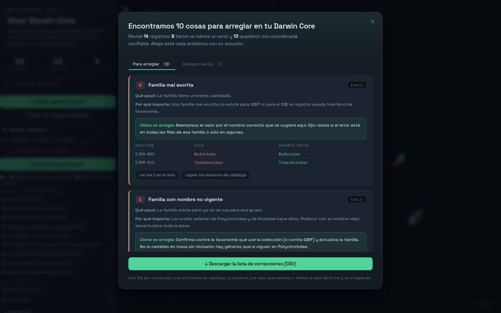

# VisionCore

Visor y validador de datos **Darwin Core** para colecciones biológicas. Abre un archivo de la plantilla del SiB Colombia o una descarga de GBIF, lo pone en un mapa y te dice qué hay que corregir antes de publicarlo — con la corrección concreta, no solo el diagnóstico.

Corre entero en el navegador: una página HTML, sin servidor, sin cuenta, sin instalar nada. **Tus registros nunca salen de tu computador**: lo único que se envía a internet, y solo si lo pides, son los nombres científicos para verificarlos (ver [Privacidad y seguridad](#privacidad-y-seguridad)).

## Para qué sirve

Publicar un conjunto de datos en el SiB o en GBIF exige que los campos sean coherentes entre sí, y en una colección con miles de registros digitados a lo largo de años esas incoherencias no se ven a simple vista: una rana registrada como reptil, una longitud sin el signo W que manda el punto a África, segundos de coordenada mayores a 60, una familia con una letra cambiada que deja al ejemplar huérfano de taxonomía. VisionCore las busca con reglas deterministas, las explica en español y propone el valor que debería ir.

En una prueba sobre las colecciones de anfibios y reptiles de la UPTC (4.315 registros) encontró errores en 1.087 registros, con 8.601 hallazgos entre errores y campos vacíos. En una descarga de GBIF de *Dendropsophus* (3.647 registros) marcó errores en 9, y los seis puntos que caen fuera de Colombia son los mismos que marca GBIF en sus propias banderas.

## Cómo se usa

**En línea:** abre [tamalete.github.io/visioncore](https://tamalete.github.io/visioncore/) y carga tu archivo; no hay que instalar nada. Aunque la página venga de GitHub, tus registros se procesan en tu navegador y no se suben a ningún lado.

**Sin conexión:**

1. Descarga el repositorio (`Code` → `Download ZIP`) y descomprímelo.
2. Abre `index.html` con doble clic. No necesita servidor; solo necesita conexión para las teselas del mapa y, si la pides, para la verificación de nombres.
3. Arrastra tu archivo a la página o usa el botón "Añadir registros (Excel, CSV o GBIF)". Acepta:
   - `.xlsx` con la plantilla Darwin Core del SiB;
   - `.csv`, `.tsv` y `.txt` (UTF-8, Windows-1252 o UTF-16; separados por coma, punto y coma o tabulador);
   - el `.zip` de una descarga de GBIF (Darwin Core Archive o descarga simple), que se descomprime en el navegador.

   Para probar primero, usa `ejemplo/ejemplo_visioncore.xlsx`: son 14 registros inventados con errores puestos a propósito.
4. Se abre la pantalla de revisión, con sus pestañas: errores del dato, campos vacíos, requisitos para publicar en el SiB, alertas de GBIF y, si la pides, verificación de nombres. Desde ahí se exporta.

Se pueden cargar varios archivos a la vez (por ejemplo, la plantilla del SiB y una descarga de GBIF): cada uno queda como una fuente con su color y se puede quitar. Mientras carga, la página muestra el avance de cada archivo.

En el panel se filtra por grupo, por tipo de registro (espécimen, iNaturalist, otra observación, muestra, cámara o grabadora), por hallazgo y por periodo en una línea de tiempo (año, lustro o década), y la lista se agrupa por familia, género, especie (como está escrita o aceptada), conjunto de datos, localidad o tipo de registro. Lo filtrado se puede exportar aparte.

## Qué revisa

Hay 62 tipos de hallazgo, más una capa de alertas, agrupados en:

- **Georreferenciación** — coordenadas ilegibles o fuera de rango, latitud y longitud intercambiadas, longitud sin hemisferio, minutos o segundos ≥ 60, grados faltantes, separador decimal perdido (también cuando el visor tomó la coordenada de otra columna), puntos fuera de Colombia, desacuerdo entre las coordenadas originales y las columnas decimales.
- **Taxonomía** — clase que no concuerda con la familia, órdenes escritos en la columna `class`, familias mal escritas o con nombres no vigentes, género y epíteto que no concuerdan con el nombre científico (en descargas de GBIF, con el nombre aceptado cuando el nombre es un sinónimo).
- **Duplicados** — el mismo número de catálogo repetido dentro de la misma institución, colección y conjunto de datos (o el mismo `occurrenceID` si no hay catálogo). Dos catálogos que solo difieren en espacios, guiones, mayúsculas o ceros a la izquierda cuentan como el mismo.
- **Fechas, altitud y vocabularios** — fechas ilegibles o imposibles, `eventDate` que no coincide con `year`, `month` y `day`, altitud escrita en la columna equivocada, en pies o fuera de rango, sexo y etapa de vida fuera del vocabulario del SiB.
- **Campos vacíos** — identificador, familia, coordenada, fecha, recolector, determinador, altitud y localidad.
- **Para publicar en el SiB** — una capa aparte, basada en el manual de la plantilla del SiB v4.0. No dice que el dato biológico esté mal, sino que, como está escrito, el SiB no lo recibiría: elementos obligatorios según el origen de los datos (colección biológica, permiso de recolección, eventos, marinos u otros), vocabularios controlados, coherencia entre `basisOfRecord` y `type`, formato de `institutionCode` y `occurrenceID`, nombres con cf., aff., sp. o autoría, listas de personas mal separadas, números de catálogo escritos de varias formas dentro de una misma serie. Donde el manual da la receta, propone el valor. En una descarga de GBIF esta capa avisa que GBIF ya reescribió esos valores.
- **Alertas de GBIF** — una pestaña aparte que no cuenta como error: las banderas de la columna `issue` de GBIF, traducidas y clasificadas en alta, media e informativa; posibles registros repetidos (misma especie, día y punto, con el mismo número de catálogo o de campo, otro conjunto de datos u otro tipo de registro), y registros que dicen ser una observación aunque el ejemplar se colectó.
- **Personas** — la misma persona escrita de varias formas en `recordedBy` o `identifiedBy`, con la forma más frecuente como propuesta. Tampoco cuenta como error.
- **Verificación de nombres** (opcional, usa internet) — compara los nombres científicos con el Catalogue of Life a través de GBIF y señala nombres mal escritos, sinónimos, nombres que el catálogo no reconoce, solo reconocidos como género, familias distintas a las del catálogo, nombres de otro grupo y especies en categoría vulnerable, en peligro o en peligro crítico de la UICN. El emparejamiento lo hace GBIF, no el visor.

Cada hallazgo trae la columna Darwin Core donde se corrige, qué pasó, por qué importa al publicar y cómo se arregla. Se exporta en cinco formas: Darwin Core `.xlsx` y `.csv` (con todas las columnas y valores originales; lo que calcula el visor va en una hoja aparte), GeoJSON, una lista de correcciones en `.xlsx` con una fila por hallazgo, pensada para abrirla al lado del Excel, y un Darwin Core `.xlsx` con las correcciones seguras ya aplicadas (vocabularios con equivalencia exacta, fechas a ISO, familias mal escritas, separador decimal perdido, `taxonRank` deducido del nombre…) y una hoja "Cambios" con cada celda que cambió. Ese archivo nunca toca identificadores ni nada que dependa de juicio, y el original no se modifica.

También lee la plantilla del SiB aunque venga maltratada: escoge la hoja correcta del libro, recupera encabezados pisados usando las etiquetas en español de la segunda fila, y acepta las coordenadas en los formatos en que realmente las escriben los colectores (`5°26'32.7"N`, `5° 26' 32,7''`, `05°26ʹ32.7ʺ N`, `5.53214N`, `72 42 41.3 W`).

## Qué NO hace

Conviene decirlo claro para no dar por buena una base solo porque pasó la revisión:

- **No es inteligencia artificial.** Son reglas lógicas verificables: cada hallazgo se puede rastrear hasta la celda que lo produjo. La verificación de nombres la hace el servicio de GBIF y solo cuando la pides; el visor muestra lo que ese servicio responde y no garantiza que esté libre de errores.
- Los registros repetidos por especie, día y punto son una alerta para revisar, no un veredicto: una serie del mismo número de campo puede ser un lote legítimo.
- No comprueba que el municipio declarado corresponda a la coordenada. La comprobación de "fuera de Colombia" usa cajas y no el contorno del país: el mar Caribe al norte de La Guajira todavía cuenta como Colombia.
- Generalizar las coordenadas de especies amenazadas es opcional y solo al exportar: si la verificación de nombres encontró especies en categoría VU, EN o CR de la UICN, aparece una casilla que redondea sus coordenadas a 0,1° y llena `dataGeneralizations` e `informationWithheld`. Es la categoría global de la UICN, no la lista nacional de especies amenazadas. **Si vas a publicar datos de especies con riesgo de tráfico, decide con la colección qué generalizar.**
- No escribe sobre tu archivo: lee, reporta y exporta archivos nuevos.

## Privacidad y seguridad

Tus datos se procesan en tu computador. Todo se hace en memoria, no se usa almacenamiento del navegador (ni `localStorage` ni `sessionStorage`) y se pierde al cerrar la pestaña. No hay analítica.

El visor hace solo dos tipos de petición a internet:

1. **Teselas del mapa**, a Esri y a OpenTopoMap. Reciben el área que estás mirando, no tus registros. Si trabajas sin conexión, el mapa queda vacío y el resto funciona igual.
2. **Verificación de nombres**, a la API de GBIF (`api.gbif.org`). **Solo ocurre si pulsas el botón de verificar.** Se envían únicamente los nombres científicos distintos del archivo (sin autoría): ni registros, ni localidades, ni coordenadas, ni personas. El botón avisa cuántos nombres se enviarán antes de hacerlo.

Además, los enlaces a gbif.org de los resultados de nombres solo se abren si les haces clic.

Las tres librerías y las dos tipografías que usa van empaquetadas dentro del repositorio, no se cargan de ningún CDN. Ver [SECURITY.md](SECURITY.md) y [POLITICA_DE_DATOS.md](POLITICA_DE_DATOS.md).

## Datos

Este repositorio **no contiene datos biológicos reales**, solo un archivo de ejemplo inventado. Las bases usadas en las pruebas pertenecen a sus colectores y a la colección de la UPTC. Ver [POLITICA_DE_DATOS.md](POLITICA_DE_DATOS.md).

## Tecnología

HTML, CSS y JavaScript sin framework ni paso de construcción. [Leaflet](https://leafletjs.com) y [Leaflet.markercluster](https://github.com/Leaflet/Leaflet.markercluster) para el mapa, [SheetJS](https://sheetjs.com) para leer los Excel. Las tres están en `vendor/` con sus licencias; ver [NOTICE](NOTICE).

## Cómo citar

Ver [CITATION.cff](CITATION.cff).

## Autoría

Ithamar Zuñiga Tinjacá — Escuela de Ciencias Biológicas, Universidad Pedagógica y Tecnológica de Colombia (Tunja, Boyacá). Desarrollado como herramienta de apoyo a colecciones biológicas; presentado en el 9.º Encuentro Internacional de la Facultad de Ciencias (IMFoS 2026, UPTC).

Los agradecimientos a quienes aportaron datos para las pruebas piloto se agregarán con sus nombres una vez estén los permisos por escrito.

## Licencia

Apache License 2.0 — ver [LICENSE](LICENSE).
